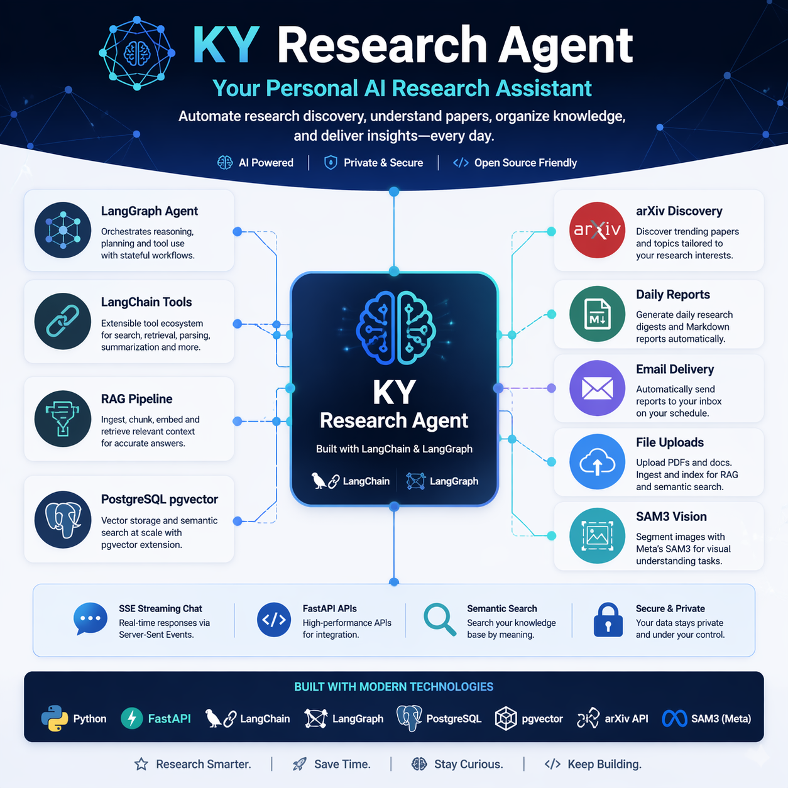

# KY Research Agent

<p align="center">
  
</p>

个人科研进展 Agent：每天从 arXiv 收集指定领域的新论文，生成 Markdown 简报并通过 Email 推送；同时支持上传个人研究进展到 public pgvector 向量库，用于语义检索、RAG 问答、Agent 工具调用和图像分割流程。

## 核心能力

- FastAPI 后端，提供普通 HTTP 接口和 SSE Agent 接口。
- LangGraph 驱动的科研 Agent，对外保持稳定 API，对内使用 LangChain/LangGraph 编排。
- arXiv 检索、关键词相关性评分、LLM 摘要与 fallback 摘要。
- Markdown 日报生成、落盘、查询、邮件发送。
- 上传 Markdown、TXT、PDF、DOCX、PNG、JPG、JPEG、WEBP、BMP。
- 上传文本抽取、切块、embedding、写入 PostgreSQL + pgvector。
- public 语义检索和 RAG 问答。
- SAM 图像分割，支持在 Agent 对话中调用。
- APScheduler 每日定时任务。

## 当前架构

### LangChain / LangGraph 部分

- `app/agents/chat_graph.py`
  - LangGraph 状态机、工具路由、工具执行、LLM 绑定。
- `app/agents/chat_prompts.py`
  - Agent 系统提示词、上传上下文、历史附件上下文。
- `app/agents/toolkit.py`
  - LangChain `StructuredTool` 适配层。
- `app/services/agent/chat_service.py`
  - 将 API 请求转换为 LangChain messages，并把 LangGraph 更新流转为 SSE。
- `app/services/ai/llm_service.py`
  - `ChatOpenAI` 封装。
- `app/services/ai/embedding_service.py`
  - `OpenAIEmbeddings` 封装和本地 fallback。
- `app/services/rag/langchain_vector_store.py`
  - 自定义 LangChain `VectorStore`，底层复用现有 SQLAlchemy + pgvector schema。
- `app/services/rag/retrieval_service.py`
  - retriever 调用、搜索结果格式化、RAG 上下文构造。
- `app/services/rag/search_service.py`
  - 基于 LangChain prompt/runnable/parser 的 RAG chain。
- `app/services/ai/query_rewrite_service.py`
  - Agent 请求重写链。

### 服务模块分层

- `app/services/agent`
  - Agent 会话服务。
- `app/services/ai`
  - LLM、embedding、query rewrite。
- `app/services/content`
  - 文件抽取、上传、文本入库。
- `app/services/notification`
  - Email。
- `app/services/observability`
  - 工具调用日志。
- `app/services/rag`
  - Vector store、检索、RAG。
- `app/services/reporting`
  - 日报生成、查询、报告入库。
- `app/services/research`
  - arXiv、研究主题。
- `app/services/runtime`
  - runtime config。

## PostgreSQL / pgvector 设计

本项目没有直接使用 LangChain 默认 PGVector 表结构，而是保留了自己的数据库 schema，再实现了一层自定义 `VectorStore` 适配。

实际存储方式：

- 文档主表：`uploaded_documents`
- 切块表：`document_chunks`
- 向量列：`document_chunks.embedding`
- 类型：`pgvector.sqlalchemy.Vector(EMBEDDING_DIMENSIONS)`

优势：

- 业务表结构可控。
- Alembic migration 清晰。
- SQLAlchemy 事务和回滚行为可控。
- 上层仍可通过 LangChain retriever / vector store 使用。

相关文件：

- `app/models/document.py`
- `app/models/chunk.py`
- `app/services/rag/langchain_vector_store.py`
- `migrations/versions/0001_initial.py`

## 快速开始

```bash
cd /mnt/hdd/cjt/ky
cp .env.example .env
UV_DEFAULT_INDEX=https://pypi.tuna.tsinghua.edu.cn/simple UV_HTTP_TIMEOUT=180 uv sync --extra dev
./scripts/pg_start.sh
./.venv/bin/alembic upgrade head
./.venv/bin/uvicorn app.api.main:app --host 0.0.0.0 --port 8000 --reload
```

如果清华源不稳定，可以换成阿里云源：

```bash
UV_DEFAULT_INDEX=https://mirrors.aliyun.com/pypi/simple UV_HTTP_TIMEOUT=180 uv sync --extra dev
```

打开 API 文档：

```text
http://localhost:8000/docs
```

## 用户态 PostgreSQL

这个项目已经在用户目录安装好了本地 PostgreSQL 和 `psql`，不依赖系统 root，也不要求 Docker。

环境位置：

```text
/mnt/hdd/cjt/local/mamba/envs/pg-local
```

数据目录：

```text
/mnt/hdd/cjt/local/pgsql/data
```

日志文件：

```text
/mnt/hdd/cjt/local/pgsql/logs/postgres.log
```

常用命令：

```bash
cd /mnt/hdd/cjt/ky
./scripts/pg_start.sh
./scripts/pg_status.sh
./scripts/pg_psql.sh
./scripts/pg_stop.sh
```

说明：

- 这套 PostgreSQL 不是系统服务。
- 机器重启后通常需要重新执行一次 `./scripts/pg_start.sh`。

## 模型与 Embedding 配置

在 `.env` 中设置：

```env
LLM_BASE_URL=https://your-mirror.example.com/v1
LLM_API_KEY=replace-me
LLM_MODEL=gpt-4o-mini

EMBEDDING_BASE_URL=https://your-mirror.example.com/v1
EMBEDDING_API_KEY=replace-me
EMBEDDING_MODEL=text-embedding-3-small
EMBEDDING_DIMENSIONS=1536
```

你实际需要填写的就是：

- `LLM_BASE_URL`
- `LLM_API_KEY`
- `LLM_MODEL`
- `EMBEDDING_BASE_URL`
- `EMBEDDING_API_KEY`
- `EMBEDDING_MODEL`
- `EMBEDDING_DIMENSIONS`

如果 API key 仍为 `replace-me`，系统会降级：

- 论文摘要使用 arXiv 摘要截断。
- embedding 使用零向量，仅用于链路验证，不适合真实检索。

## Email 配置

在 `.env` 中设置：

```env
EMAIL_ENABLED=true
SMTP_HOST=smtp.example.com
SMTP_PORT=465
SMTP_USER=your-email@example.com
SMTP_PASSWORD=replace-me
SMTP_USE_TLS=true
EMAIL_FROM=your-email@example.com
EMAIL_TO=your-email@example.com
```

如果未完成 SMTP 配置，系统会跳过邮件发送，但仍保留日报文件和相关流程。

## SAM 图像分割功能

系统已集成 SAM 分割能力，可通过普通接口或 Agent 工具调用。

相关实现：

- `app/integrations/sam3/service.py`
- `app/integrations/sam3/runner.py`
- `app/api/routes/vision.py`
- Agent 工具名：`segment_image_with_sam`

支持方式：

- 直接调用视觉接口 `/vision/sam-segment`
- 在 `/agent/chat/stream` 或 `/agent/chat/stream-with-files` 中让 Agent 决定是否调用 SAM

运行时配置位于 runtime config 中，典型字段包括：

- `sam.enabled`
- `sam.python_executable`
- `sam.project_root`
- `sam.checkpoint_path`
- `sam.bpe_path`
- `sam.output_dir`
- `sam.device`
- `sam.confidence_threshold`
- `sam.top_k`

如果配置缺失，SAM 工具会返回结构化错误，而不是直接导致整个 Agent 崩掉。

## 研究主题配置

编辑：

```text
configs/topics.yaml
```

修改 `query`、`arxiv_categories`、`include_keywords`、`exclude_keywords` 后，调用：

```bash
curl -X POST http://localhost:8000/topics/sync
```

## 手动运行每日报告

不发送邮件，仅生成报告：

```bash
uv run python scripts/run_daily_report.py --topic llm_agents --no-email
```

报告会写入：

```text
storage/reports/llm_agents/YYYY-MM-DD.md
```

## 主要 API

```text
GET  /health

GET  /topics
POST /topics/sync
POST /topics
PUT  /topics/{topic_name}
DELETE /topics/{topic_name}

POST /reports/run-daily
GET  /reports
GET  /reports/{report_id}
GET  /reports/{report_id}/content

POST /uploads
GET  /uploads

POST /search
POST /chat

POST /agent/chat/stream
POST /agent/chat/stream-with-files

GET  /email/config-status
POST /email/send
POST /email/send-report

POST /vision/sam-segment
```

更完整的前端接口说明见：

```text
docs/api_for_frontend.md
```

## 开发检查

```bash
uv run ruff check .
uv run pytest
```

## 可选 Streamlit 页面

前端原型依赖较大，按需安装：

```bash
uv sync --extra dev --extra frontend
uv run streamlit run frontend/streamlit_app.py
```

## 推送到 GitHub

如果本地已经配置好 GitHub SSH，可直接：

```bash
cd /mnt/hdd/cjt/ky
git status
git add .
git commit -m "Update README"
git push
```

首次绑定远端时类似：

```bash
git branch -M main
git remote add origin git@github.com:<user>/<repo>.git
git push -u origin main
```

## VS Code Remote 端口转发

如果你通过 VS Code Remote SSH 连接到服务器，常见需要转发：

- FastAPI: `8000`
- Streamlit: `8501`
- PostgreSQL: `5432`

常见地址：

```text
FastAPI docs: http://127.0.0.1:8000/docs
FastAPI health: http://127.0.0.1:8000/health
Streamlit: http://127.0.0.1:8501
```

## 注意事项

- 本项目默认上传内容为 `public`，个人使用阶段也不要上传敏感材料。
- pgvector 的 embedding 维度必须与 `.env` 中的 `EMBEDDING_DIMENSIONS` 一致。
- 切换 embedding 模型后，已有向量需要重建。
- arXiv API 有频率限制，不要高频反复运行。
- 运行态数据如 `storage/*.json`、`storage/tool_logs/`、`storage/sam_outputs/` 默认不纳入 Git。
